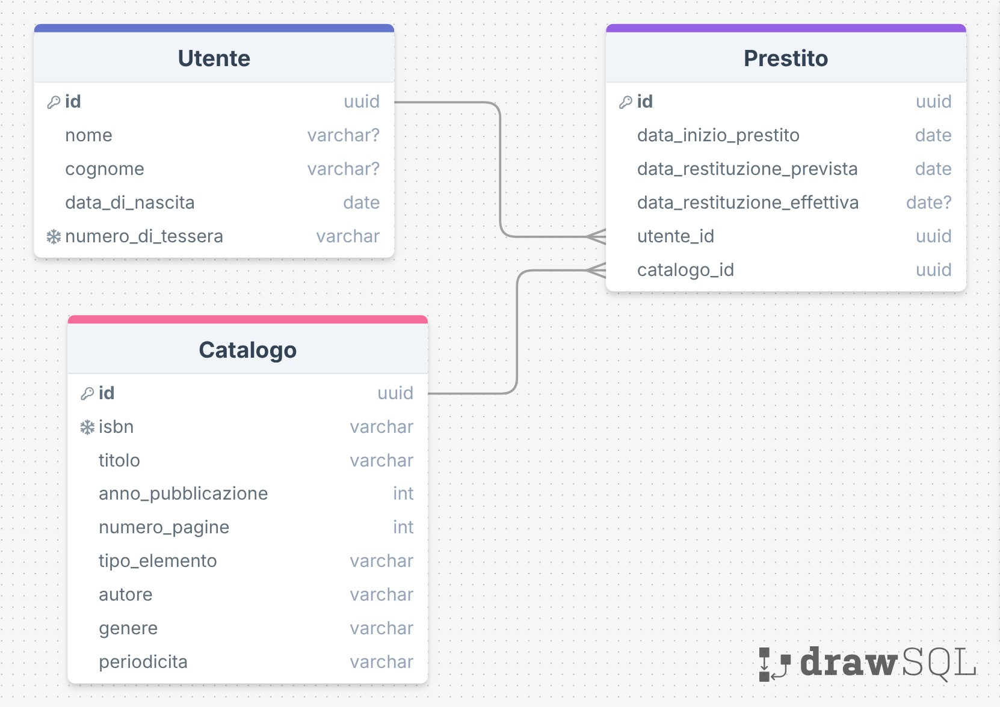
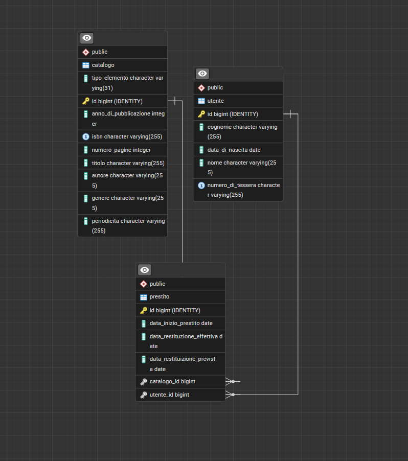

## Diagramma ER

## PgAdmin

## Scelte progettuali

Libro e rivista estendono la classe Catalago, per mappare questa gerarchia sul Database ho scelto la strategia
@Inheritance(strategy = InheritanceType.SINGLE_TABLE).

La colonna discriminatore creata automaticamente da hybernate l'ho chiamata tipo_elemento e contiene il nome
della classe concreta ("Libro", "Rivista").

Come richiesto dalla traccia sia il codice isbn sia il numero_tessera sono delle UK dichiarate come @Column(unique =
true)

Per autogenerare la data_di_restituzione_prevista ho usato @PrePersist per fare in modo di evocare il metodo prima
di ogni INSERT.

Ho usato sia @NamedQueries (sulla classe Prestito), sia query inline direttamente nel Dao.

ogni Entity ha il suo dao associato